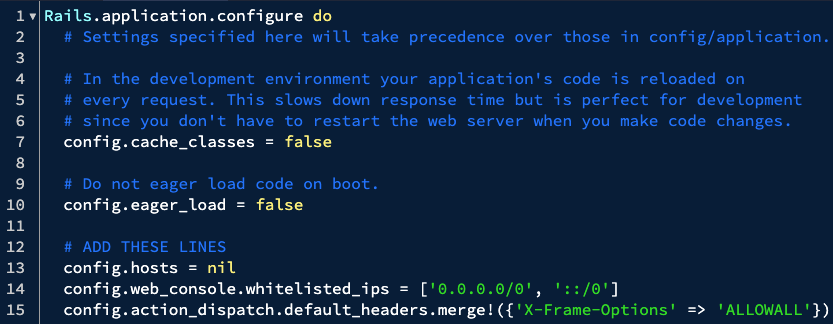
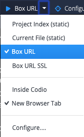

If you are developing in Codio, we need to add a few lines of code to `config/environments/development.rb`.

`config.hosts = nil` removes the filter for domain name enabled in ruby by default.
`config.web_console.whitelisted_ips = ['0.0.0.0/0', '::/0']` allows you to see errors content from any browser. By default, these are limited to localhost.
`config.action_dispatch.default_headers.merge!({'X-Frame-Options' => 'ALLOWALL'})` allows the rails site to be embedded into the Codio preview iframe.

When you have added these three lines, your file should look like:



In the terminal (which you can open using Tools > Terminal) use the following command to start the app:
`rails server -b 0.0.0.0`


To view your movies review site, use the Preview button that says `Project Index` in the top tool bar. Click the drop down and select `Box URL` 



For subsequent previews, you will not need to press the drop down – your button should now read "Box URL".

If you now try the URI `https://your-codiobox-3000.codio.io/movies`, should get a Routing Error from Rails. You can get `your-codiobox` from your terminal. When you open a new terminal, among the first few lines printed out, you will see a line that matches the following format:
```shell script
* Your Codio Box domain is: [your-codiobox].codio.io
```
